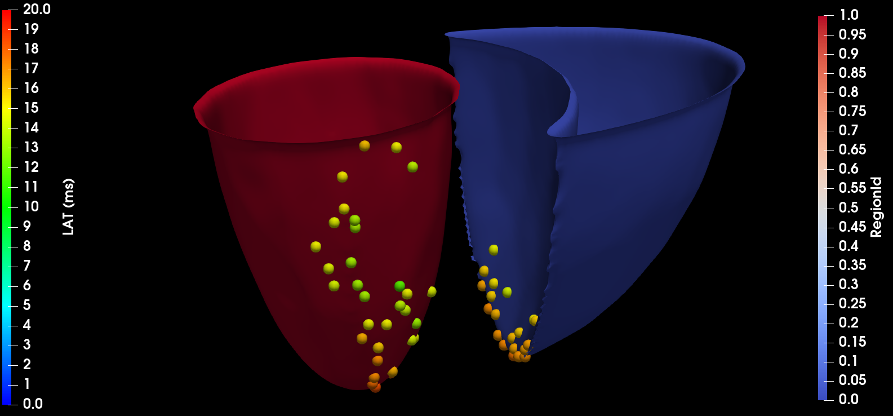
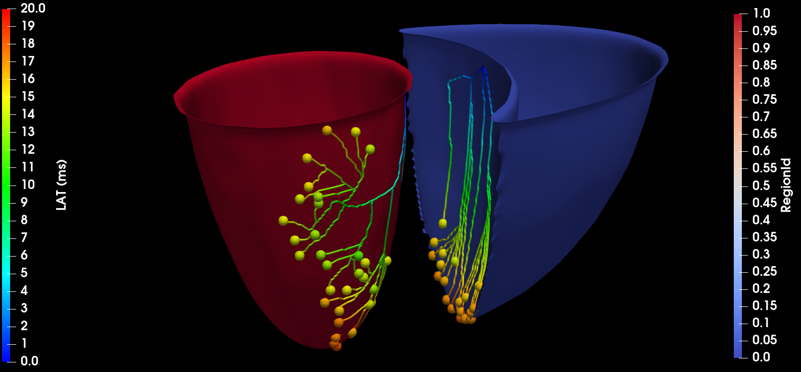

# Shocker

Program to generate patient-specific Purkinje Networks within an endocardium surface given by triangles.

## Dependencies

- C++ compiler
- CMake
- VTK library

## How to install

To install CMake, run the following command in a Fedora machine:

```sh
$ sudo dnf install cmake
```

The VTK library can be installed alongside the Paraview program which will enable the visualization of the generated Purkinje networks. 

To install Paraview, run the following command in a Fedora machine:

```sh
$ sudo dnf install paraview
```

## Compile and run

To compile the source code you can use the available script.

```sh
$ ./recompile_project.sh
```

To run a simulation you need to pass a configuration file as input. There are some samples in the ```inputs``` folder.

Generate a Purkinje network in the LV surface.
```sh
./bin/Shocker inputs/simplified_LV.ini
```

Generate a Purkinje network in the RV surface.
```sh
./bin/Shocker inputs/simplified_RV.ini
```

The output files are stored in the ```outputs``` folder. Remember to create this folder before running a simulation. 

The program generates a Purkinje network that connects the active Purkinje-Ventricular-Junctions (PVJs) with their respective locations and Local Activation Times (LATs).





## How to cite this work
----

Berg, L. A, Rocha, B. M., Oliveira, R. S., Sebastian, R., Rodriguez, B., de Queiroz, R. A. B., Cherry, E. M., dos Santos, R. W. Enhanced optimization-based method for the generation of patient-specific models of Purkinje networks. Nature Scientific Reports. https://www.doi.org/10.1038/s41598-023-38653-1


